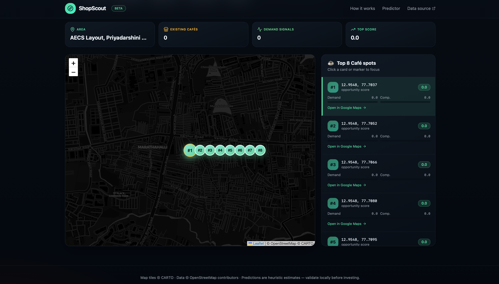
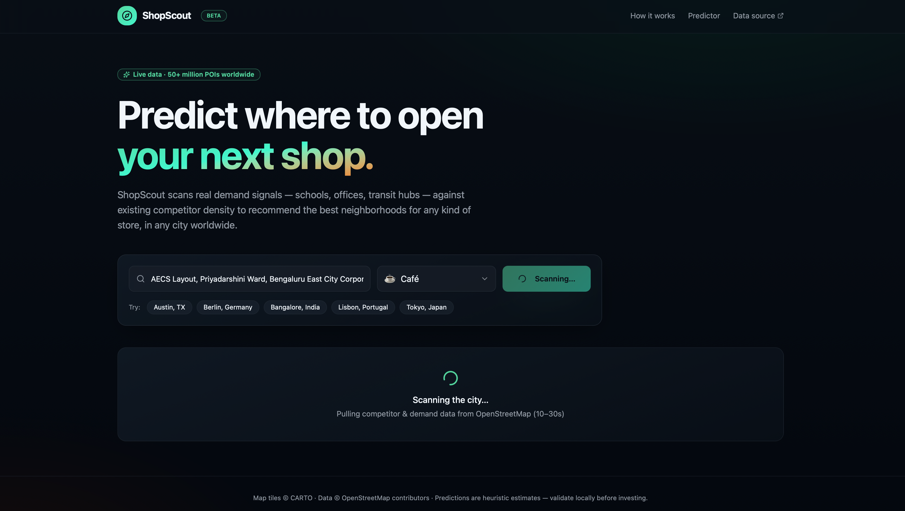

# ML Shop Prediction System
API for this project: https://new-shop-navigator.lovable.app
## Project Overview
ShopScout is an AI-powered shop prediction system that helps users identify the best locations to open a new shop based on demand signals, competitor density, and geographic analysis.

The application analyzes real-time location data and predicts high-opportunity business areas using machine learning and map-based visualization.

---

## Features
- 📍 Smart location prediction
- 🗺 Interactive map visualization
- 📊 Demand signal analysis
- 🏪 Competitor density tracking
- 🤖 Machine learning-based recommendations
- 🌐 Real-time geographic insights

---

## Technologies Used
- Python
- Machine Learning
- Flask / Streamlit
- OpenStreetMap API
- Leaflet.js
- Pandas
- NumPy
- Scikit-learn

---

## User Interface

### Home Page

---

### Prediction Dashboard

